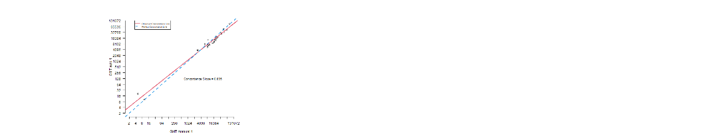
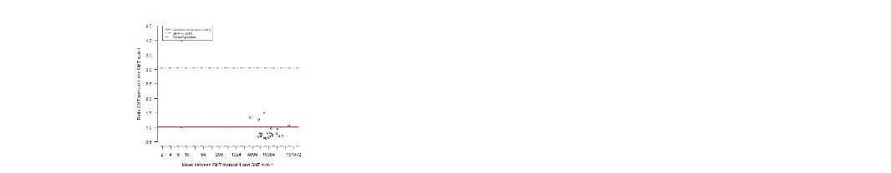

```{r setup, include=FALSE}
library(flextable)

set_flextable_defaults(fonts_ignore=TRUE)

format_table <- function(df){
  df_ft <- flextable(data = df,
                     col_keys = names(df))
  df_ft <- df_ft %>%
    set_table_properties(width = 1, layout = "autofit") %>%
    theme_box()
  
  df_ft <- fontsize(x = df_ft, size = 9, part = c("all"))
  df_ft <- font(x = df_ft, fontname = "arial")
  
  return(df_ft)
}


print("RMD START")
knitr::opts_chunk$set(echo = TRUE)

transposition_table <- function(df,name_first_col){
  df <- t(df)
  df <- as.data.frame(df)
  names(df) <- df[1, ]
  df <- df[-1, ]
  df <- df %>% mutate_if(is.character, as.numeric)
  df <- df %>% mutate_if(is.numeric, round, digit = 2)
  df <- tibble::rownames_to_column(df, name_first_col)
  return(df)
}

path_info <- paste0("output/output_report/info.csv")
df.info <- read.csv(path_info)

n_sample <- df.info[2,2]

n_sample_without_lloq <- n_sample-1

type_criteria <- params$type_criteria # None or Percent_diff & Fold_diff

# SETUP parameters
cutoff_state <- TRUE
if(params$cutoff.x[1] == ""){
  cutoff_state <- FALSE
}

```


# `r params$title`

# 1.   Context
`r params$assay_info`

# 2.   Statistical methodology
<br><br><br>
```{r echo=FALSE, results='asis'}
string.var <- ""
for (i in seq(1,length(params$var.x.name))) {
    if(i!=1){string.var <- paste0(string.var, ", and ")}
    string.var <- paste0(string.var, "[***", params$var.x.name[i], "*** and ***", params$var.y.name[i], "***]")
}
mystring <- paste0("The concordance between ", string.var, " has been evaluated using the statistical methodology available in the guidance GDMS_514936 by modeling a regression line between these 2 parameters (form of the equation: Y=a.X + b,")
cat(mystring)
```
where Y=***`r params$var.y.name`*** and X=***`r params$var.x.name`***.


Variables are analyzed in log `r params$log_transfo`

In this report, the concordance has been verified using:
<br><br>

- The 90% confidence interval of the slope was included in the equivalence interval [0.80 ; 1.25].

```{r echo=FALSE, results='asis', eval=(type_criteria=="Percent_diff")}
cat(paste0("- The % Diff was included in the equivalence interval [-",params$percent_diff,"% ; ",params$percent_diff,"%].\n\n"))
cat("-------")
```

```{r echo=FALSE, results='asis', eval=(type_criteria=="Fold_diff")}
cat(paste0("- The 90%CI of the fold difference was included [",round(1/params$fold_diff,2)," ; ",params$fold_diff,"].\n\n"))
cat("-------")
```


Other criteria may be used and could be essential to demonstrate concordance the conclusion section shall be edited accordingly, and the word version will be approved in applicable system by the scientist and the statistician responsible for the analysis.

```{r echo=FALSE, results='asis'}
mystring <- paste0("The Bland and Altman graph with limits +/- 2*standard deviation of the difference to identify outlier values and the ratio between ",string.var,"  are given for information.")
cat(mystring)
```

Data are available in Appendix 1, the data  were not taken into account in the analysis, either because of a missing value, or because the data of at least one of the 2 parameters were below the LLOQ. 


# 3.   Limit of quantification

```{r echo=FALSE, results='asis'}
string.var <- "The limit of quantification has been set to:"
string.log <- ""
for (i in seq(1,length(params$var.x.name))) {
    # if(i!=0){string.var <- paste0(string.var, "\n- ")}
  if (params$units == "UNITS"){
    unit.text <- ""
  }
  else{
    unit.text <- paste0("(", params$units,")")
  }
    string.log <- paste0(string.log, "\n","- LOQ = [ X = ", params$LLOQ.x[i], " ",unit.text, " ; Y =  ", params$LLOQ.y[i]," ", unit.text,"] between [***", params$var.x.name[i], "*** and ***", params$var.y.name[i], "***].")
}
cat(paste0(string.var, "\n",string.log))
```

```{r echo=FALSE, results='asis', , eval=(cutoff_state)}
string.var <- "The limit of cutoff has been set to:"
string.log <- ""
for (i in seq(1,length(params$var.x.name))) {
    # if(i!=0){string.var <- paste0(string.var, "\n- ")}
  if (params$units == "UNITS"){
    unit.text <- ""
  }
  else{
    unit.text <- paste0("(", params$units,")")
  }
    string.log <- paste0(string.log, "\n","- Cutoff = [ X = ", params$cutoff.x[i], " ",unit.text, " ; Y =  ", params$cutoff.y[i]," ", unit.text,"] between [***", params$var.x.name[i], "*** and ***", params$var.y.name[i], "***].")
}
cat(paste0(string.var, "\n",string.log))
```

Any sample, for which the result of at least one parameter was below the LOQ, was excluded from the analysis.  The excluded samples are presented in the following table:

**Table 1: Excluded data as below the LOQ**
```{r echo = FALSE, warning = FALSE, message=FALSE}
library(knitr)
library(dplyr)

path_lloq <- paste0("output/output_report/data_lloq.csv")
data_lloq <- read.csv(file = path_lloq, sep = ",")

names(data_lloq) <- gsub("\\.", " ", names(data_lloq))

format_table(data_lloq)
```

# 4.   Results

## 3.1) Descriptive statistics

**Table 2: Information concerning missing values or values below LOQ**
```{r  echo=FALSE, results='asis'}
library(stringr)

list_path <- list.files(path = paste0("output/output_report/SAT/"),
                        full.names = FALSE, recursive = FALSE)

all_tables <- c()

for (t in list_path) {
  nb <- strsplit(t, "__")[[1]][1]
  concordance_var <- strsplit(t, "__")[[1]][2]
  table <- strsplit(t, "__")[[1]][3]
  
  var_x <- strsplit(concordance_var, "_")[[1]][1]
  var_y <- strsplit(concordance_var, "_")[[1]][3]
  
  concordance_var <- str_replace_all(concordance_var,"_"," ")
  
  if (table == "table_SAT.csv") {
    tab_SAT <- read.csv(paste0("output/output_report/SAT/", t))
    tab_SAT <- tab_SAT[-4,]
    names(tab_SAT) <- c("Parameter", paste0(var_y," < LOQ"), paste0(var_y," > LOQ"), "Sub total")
    tab_SAT[,1] <- c(paste0(var_x," < LOQ"), paste0(var_x," > LOQ"), "Sub total")
    tab_SAT <- as.data.frame(tab_SAT)
    
    all_tables <- c(all_tables,
                    "\n\nTable for ", concordance_var,"\n",
                    knit_print(format_table(tab_SAT)))
    
  } else {
    # tab_PCT <- read.csv(paste0("output/output_report/SAT/", t))
    # 
    # all_tables <- c(all_tables,
    #                 "\n\nTable for ", concordance_var,"\n",
    #                 knit_print(format_table(tab_PCT)))
  }
}

asis_output(all_tables)

```

The concordance study was realized on transformed data in log`r params$log_transfo`.

**Table 3: Descriptive statistics**

```{r  echo=FALSE}
path_desc <- paste0("output/output_report/descriptive_stat.csv")
desc <- read.csv(path_desc, sep = ",")

# Convert all columns to character to ensure consistent data manipulation
desc <- lapply(desc, as.character)
desc <- as.data.frame(desc)

# Update column names
names(desc) <- c("Param", "N samples", "Mean", "Mean (log10)", "Variance(log10)", 
                 "Standard deviation (log10)", "Min", "Max")

# Replace dots with spaces in the 'Param' column
desc$Param <- gsub("\\.", " ", desc$Param)

format_table(desc)
```


## 4.2) Graphical representation of the Statistical Linear Relationship (Concordance Regression) between the variables studied


**Figure 1: Relation between the 2 variables studied - Regression between X `r unit.text` variables and Y variables `r unit.text`**

```{r  echo=FALSE,out.width = '100%'}

```


**Figure 2: Relation between the 2 variables studied - Graphic of Bland & Altman between X variables `r unit.text` and Y variables `r unit.text`**

```{r  echo=FALSE,message=FALSE, warning=FALSE,out.width = '100%'}
list_path <- list.files(path = "output/", 
                        full.names = FALSE, recursive = FALSE)
library(png)
library(grid)
library(gridExtra)


```


## 4.3) Estimation of the parameters of the linear regression

**Table 4: Total number of results and of analysed results**
```{r  echo=FALSE}
path_desc_lloq <- paste0("output/output_report/descriptive_stat_lloq.csv")
desc_lloq <- read.csv(file = path_desc_lloq, sep = ",")

data_lloq_recap <- data.frame(`Analysis  Var Y VS Var X` = c(),
                              `Total number of results` = c(),
                              `Number of analysed result` = c())

# Replace dots with spaces in the 'Param' column
desc_lloq$variables <- gsub("\\.", " ", desc_lloq$variables)

for (i in seq(length(params$var.x))){
  x <- params$var.x[i]
  y <- params$var.y[i]
  
  temp <- desc_lloq %>% filter(variables == x | variables == y)
  data_lloq_recap[i,1] <- paste0(x ," VS ", y)
  data_lloq_recap[i,2] <- temp$Total.number.of.results[1]
  data_lloq_recap[i,3] <- min(temp$Number.of.analyzed.results)
}
names(data_lloq_recap) <- c("Parameter X VS Parameter Y", "Total number of results","Number of analysed results")
format_table(data_lloq_recap)
```


**Table 5: Table of Pearson correlation coefficient and pvalue associated**


```{r  echo=FALSE, warning=FALSE}
path_rho <- paste0("output/output_report/rho.csv")
df.rho <- read.csv(path_rho, sep = ",")
for (i in seq(1,length(df.rho$list_analysis))){
  df.rho[i,1] <- strsplit(df.rho$list_analysis[i], "__")[[1]][2]
  a <- df.rho[i,1]
  df.rho[i,1] <- paste0(strsplit(a, "_VS_")[[1]][2],"_VS_", strsplit(a, "_VS_")[[1]][1])
}

df.rho$list_analysis <- gsub("_", " ", df.rho$list_analysis)
names(df.rho) <- c("Analysis (Var Y VS Var Y)", "Pearson correlation coeff", "P-values (Corr=1)")
format_table(df.rho[,c(1,2)])
```


**Table 6: Confidence intervals estimation**

```{r echo=FALSE, eval=(type_criteria=="None")}
path_results <- paste0("output/output_report/results_.csv")
res <- read.csv(file = path_results, sep = ",")
colnames(res) <- gsub(".CI.","%CI", colnames(res))
res <- res %>% select_all(~gsub("\\s+|\\.", " ", .))

names(res)[3:5] <- c("Conc Slope [90%CI]", "Average Diff [90%CI]", "Fold difference [90%CI]")
format_table(res)
```


```{r echo=FALSE, eval=(type_criteria=="Percent_diff")}
path_results <- paste0("output/output_report/results_.csv")
res <- read.csv(file = path_results, sep = ",")
colnames(res) <- gsub(".CI.","%CI", colnames(res))
res <- res %>% select_all(~gsub("\\s+|\\.", " ", .))

for (i in seq(1,length(res[,1]))){
  res[i,1] <- paste0(strsplit(res[i,1], " VS ")[[1]][2]," VS ", strsplit(res[i,1], " VS ")[[1]][1])
}

names(res)[3:5] <- c("Conc Slope [90%CI]", "Average Diff [90%CI]", "GMR Y/X [90%CI]")


format_table(res)
```

```{r echo=FALSE, eval=(type_criteria=="Fold_diff")}
path_results <- paste0("output/output_report/results_.csv")
res <- read.csv(file = path_results, sep = ",")
colnames(res) <- gsub(".CI.","%CI", colnames(res))
res <- res %>% select_all(~gsub("\\s+|\\.", " ", .))

names(res)[3:5] <- c("Conc Slope [90%CI]", "Average Diff [90%CI]", "Fold difference [90%CI]")
format_table(res)
```

# 5.   Conclusion

```{r echo=FALSE, results='asis'}
mystring <- paste0("The following conclusion has been generated under the hypothesis of equality of repeatability variances between ", string.var,".")
cat(mystring)
```


```{r  include=FALSE, results='asis', eval=(type_criteria=="None")}
list_concordance_status <- c()
list_slope_status_accepted <- c()

for (i in (seq(1,length(res[,1])))){
  slope_res <- strsplit(x = res[i, 3], split = " ")[[1]]
  slope <- as.numeric(slope_res[1])
  slope_min <- as.numeric(substr(slope_res[2], 2, nchar(slope_res[2])))
  slope_max <- as.numeric(substr(slope_res[4], 1, nchar(slope_res[4]) - 1))
  
  slope_status.accepted <- slope_max <= 1.25 & slope_min >= 0.8
  slope_status.rejected <- slope_max > 1.25 | slope_min < 0.8
  
  concordance_status <- slope_status.accepted
  
  ## ADD ELEMENT TO THE LIST
  list_concordance_status <- c(list_concordance_status, concordance_status)
  list_slope_status_accepted <- c(list_slope_status_accepted, slope_status.accepted)
}
```

```{r echo=FALSE, results='asis', eval=(type_criteria=="None")}
for (i in seq(1,length(params$var.x.name))){

  concordance_status <- list_concordance_status[i]
  slope_status <- list_slope_status_accepted[i]
  
  cat(paste0("The concordance between ", params$var.y.name[i], " ",unit.text," and ", params$var.x.name[i],  " ",unit.text," was ", if(!concordance_status){'***NOT***'}else{''}, " demonstrated: the 90% confidence interval of the slope was ", if(!slope_status){'***NOT***'}, " included in the equivalence interval [0.80 ; 1.25].\n\n"))
}

cat("-------")
```

```{r echo=FALSE, results='asis', eval=(type_criteria=="None")}
cat(paste0("The fold difference (90%CI) between ", params$var.y.name," ",unit.text," and ",params$var.x.name, " ",unit.text, " was equal to ", res$`Fold difference [90%CI]`,".\n\n"))
cat("-------")
```


```{r include=FALSE, results='asis', eval=(type_criteria=="Percent_diff")}
list_concordance_status <- c()
list_slope_status_accepted <- c()
list_GMR_status_accepted <- c()

for (i in (seq(1,length(res[,1])))){
  slope_res <- strsplit(x = res[i, 3], split = " ")[[1]]
  slope <- as.numeric(slope_res[1])
  slope_min <- as.numeric(substr(slope_res[2], 2, nchar(slope_res[2])))
  slope_max <- as.numeric(substr(slope_res[4], 1, nchar(slope_res[4]) - 1))
  
  slope_status.accepted <- slope_max <= 1.25 & slope_min >= 0.8
  slope_status.rejected <- slope_max > 1.25 | slope_min < 0.8
  
  
  GMR_res <- strsplit(x = res[i, 4], split = " ")[[1]]
  GMR <- as.numeric(GMR_res[1])
  GMR_min <- as.numeric(substr(GMR_res[2], 2, nchar(GMR_res[2])))
  GMR_max <- as.numeric(substr(GMR_res[4], 1, nchar(GMR_res[4]) - 1))
  
  GMR_status.accepted <-
    GMR_max <= params$percent_diff & GMR_min >= -params$percent_diff
  GMR_status.rejected <-
    GMR_max > params$percent_diff | GMR_min < -params$percent_diff
  
  
  concordance_status <- slope_status.accepted & GMR_status.accepted
  
  ## ADD ELEMENT TO THE LIST
  list_concordance_status <- c(list_concordance_status, concordance_status)
  list_slope_status_accepted <- c(list_slope_status_accepted, slope_status.accepted)
  list_GMR_status_accepted <- c(list_GMR_status_accepted, GMR_status.accepted)
  print(list_slope_status_accepted)
}
```

```{r echo=FALSE, results='asis', eval=(type_criteria=="Percent_diff")}
for (i in seq(1,length(params$var.x.name))){

  concordance_status <- list_concordance_status[i]
  slope_status <- list_slope_status_accepted[i]
  GMR_status <- list_GMR_status_accepted[i]
  
  cat(paste0("The concordance between ", params$var.y.name[i], " ",unit.text," and ", params$var.x.name[i],  " ",unit.text," was ", if(!concordance_status){'***NOT***'}else{''}, " demonstrated: the 90% confidence interval of the slope was ", if(!slope_status){'***NOT***'}, " included in the equivalence interval [0.80 ; 1.25] and the percent difference was ",if(!GMR_status){'***NOT***'}," included in [-",params$percent_diff,"% ; ",params$percent_diff,"%].\n\n"))
}


cat("-------")
```

```{r echo=FALSE, results='asis', eval=(type_criteria=="Percent_diff")}
cat(paste0("The GM ratio (90%CI) between ", params$var.y.name, " ",unit.text," and ",params$var.x.name, " ",unit.text,") "," was equal to ", res$`GMR  90%CI`,".\n\n"))
cat("-------")
```

```{r  include=FALSE, results='asis', eval=(type_criteria=="Fold_diff")}
list_concordance_status <- c()
list_slope_status_accepted <- c()
list_GMR_status_accepted <- c()

for (i in (seq(1,length(res[,1])))){
  slope_res <- strsplit(x = res[i, 3], split = " ")[[1]]
  slope <- as.numeric(slope_res[1])
  slope_min <- as.numeric(substr(slope_res[2], 2, nchar(slope_res[2])))
  slope_max <- as.numeric(substr(slope_res[4], 1, nchar(slope_res[4]) - 1))
  
  slope_status.accepted <- slope_max <= 1.25 & slope_min >= 0.8
  slope_status.rejected <- slope_max > 1.25 | slope_min < 0.8
  
  
  GMR_res <- strsplit(x = res[1,5], split = " ")[[1]]
  GMR <- as.numeric(GMR_res[1])
  GMR_min <- as.numeric(substr(GMR_res[2], 2, nchar(GMR_res[2])))
  GMR_max <- as.numeric(substr(GMR_res[4], 1, nchar(GMR_res[4]) - 1))
  
  GMR_status.accepted <-
    GMR_max <= 2 & GMR_min >= 0.5
  GMR_status.rejected <-
    GMR_max > 2 | GMR_min < 0.5
  
  concordance_status <- slope_status.accepted & GMR_status.accepted
  
  ## ADD ELEMENT TO THE LIST
  list_concordance_status <- c(list_concordance_status, concordance_status)
  list_slope_status_accepted <- c(list_slope_status_accepted, slope_status.accepted)
  list_GMR_status_accepted <- c(list_GMR_status_accepted, GMR_status.accepted)
}
```


```{r echo=FALSE, results='asis', eval=(type_criteria=="Fold_diff")}
for (i in seq(1,length(params$var.x.name))){
  concordance_status <- list_concordance_status[i]
  slope_status <- list_slope_status_accepted[i]
  GMR_status <- list_GMR_status_accepted[i]
  
  cat(paste0("The concordance between ", params$var.y.name[i], " ",unit.text, " and ", params$var.x.name[i], " ",unit.text, " was ", if(!concordance_status){'***NOT***'}else{''}, " demonstrated: the 90% confidence interval of the slope was ", if(!slope_status){'***NOT***'}, " included in the equivalence interval [0.80 ; 1.25] and the 90% confidence interval of the fold difference was ", if(!GMR_status){'***NOT***'}, " included in [",round(1/params$fold_diff,2)," ; ",params$fold_diff,"].\n\n"))
}


cat("-------")
```


```{r echo=FALSE, results='asis', eval=(type_criteria=="Fold_diff")}
cat(paste0("The fold difference (90%CI) between ", params$var.y.name," ",unit.text," and ",params$var.x.name, " ",unit.text, " was equal to ", res$`Fold difference [90%CI]`,".\n\n"))
cat("-------")
```


Note: If the 90% confidence interval acceptance criteria of the slope is different from [0.80, 1.25] and/or the %difference is different than [-`r params$percent_diff`% ; `r params$percent_diff`%] or the 90%CI shall be used instead of the point estimate, etc.  are needed to conclude equivalency, please edit the conclusion section to match the acceptance criteria that need to be applied to this concordance study. Submit the updated report in the applicable system workflow of approbation, including a qualified statistician for the scope of the study.
An additional appendix could be added to include the original data as only the data used for the analyses are included in Appendix 1. The .pdf version of the report obtained directly by the tool shall also be attached in an appendix for traceability reasons.


# Appendix 1: Data used for the concordance analysis

Remark: the data highlighted in grey were not taken into account in the analysis, either due to the presence of missing values, or because the data of at least one of the two parameters were below the LOQ.

```{r  echo=FALSE}
path_data <- paste0("data/",params$data,".csv")
data <- read.csv2(path_data, sep = separator_excel)

index.table.colnames <- data.frame(old_names <- c(params$var.x,params$var.y),
                                   new_names <- c(params$var.x.name,params$var.y.name))
colnames(index.table.colnames) <- c("old","new")

for (i in seq(1, length(names(data)))) {
  index <- which(index.table.colnames$old == names(data)[i])
  if (!identical(index, integer(0))) {
    if (index.table.colnames$new[index] != "") {
      names(data)[i] <- index.table.colnames$new[index]
    }
  }
}

data <- lapply(data, as.character)
data <- as.data.frame(data)
format_table(data)
```


# Appendix 2: Additional Results for GCI use

```{r  echo=FALSE, results = "asis"}
list_path <- list.files(path = paste0("output/output_report/SAT/"),
                        full.names = FALSE, recursive = FALSE)

all_tables <- c()

for (t in list_path) {
  nb <- strsplit(t, "__")[[1]][1]
  concordance_var <- strsplit(t, "__")[[1]][2]
  table <- strsplit(t, "__")[[1]][3]
  
  var_x <- strsplit(concordance_var, "_")[[1]][1]
  var_y <- strsplit(concordance_var, "_")[[1]][3]
  
  concordance_var <- str_replace_all(concordance_var,"_"," ")
  
  if (table == "table_SAT.csv") {
    tab_SAT <- read.csv(paste0("output/output_report/SAT/", t))
    tab_SAT <- tab_SAT[-4,]
    names(tab_SAT) <- c("Parameter", paste0(var_y," < LOQ"), paste0(var_y," > LOQ"), "Sub total")
    tab_SAT[,1] <- c(paste0(var_x," < LOQ"), paste0(var_x," > LOQ"), "Sub total")
    tab_SAT <- as.data.frame(tab_SAT)
    
    all_tables <- c(all_tables,
                    "\n\nTable for ", concordance_var,"\n",
                    knit_print(format_table(tab_SAT)))
    
  } else {
    tab_PCT <- read.csv(paste0("output/output_report/SAT/", t))
    
    all_tables <- c(all_tables,
                    "\n\nTable for ", concordance_var,"\n",
                    knit_print(format_table(tab_PCT)))
  }
}

asis_output(all_tables)
```


